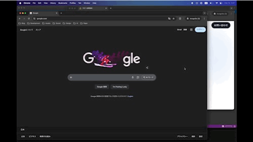

# Framis

Zone-first window management for macOS.

  

## What is Framis?

Most window managers make you drag windows into zones. Framis flips that — you pick a zone first, then choose which window goes there.

This means you can target specific windows, even when you have multiple windows from the same app.

## Features

- **Zone → Window workflow** — Select a zone, pick a window. No dragging.
- **8 built-in layouts** — Split, thirds, maximize, and more
- **Window search** — Type to filter windows by name
- **Multi-monitor** — Per-display layouts with resolution awareness
- **Keyboard-driven** — Full keyboard navigation in Arrange Mode
- **Customizable hotkey** — Set your preferred shortcut to enter Arrange Mode

## Keyboard Shortcuts

### Arrange Mode (default: Ctrl + Option + F)

| Key | Action |
|-----|--------|
| `1`–`9` | Select zone |
| `↑` `↓` | Navigate window list |
| `Enter` | Assign window to zone |
| `Tab` / `Shift+Tab` | Next / previous zone |
| `[` `]` | Switch layout |
| `Esc` | Back / Exit |
| Type any text | Search windows |
| Hold `Option` | Peek through overlay |

## Requirements

- macOS 15.6+
- Accessibility permission (granted on first launch)

## Download

[Download the latest release](https://github.com/LabeeHive/Framis-releases/releases/latest)

For more information, visit [framis.labee.dev](https://framis.labee.dev).

## License

Copyright © 2026 Labee LLC. All rights reserved.
